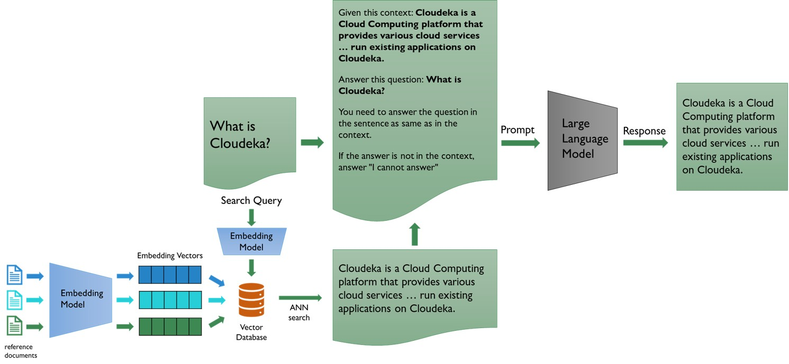

# A basic example of Retrieval Augmented Generation (RAG)

This repository provides a basic example of RAG using Langchain. This example gives you a clear view about how RAG works down to the most fundamental aspect about Large Language Model (LLM), that is, it only receives text as input.

Below is a figure that clearly illustrate how RAG works. It shows that, in the end, LLM only receives text as input. The retrieved document from a vector database and the user prompt are stitched together as a text that serves as the actual prompt to an LLM.



## Installation

To run the sample codes in this repository, run the following command:

```bash
pip install -r requirements.txt
```

As this repository use an LLM and an embedding model from Deka LLM API by Lintasarta Cloudeka, you need to put Deka LLM API key in the [var.enve](var.env) file to access Deka LLM. You can get your API key by contacting Lintasarta Cloudeka [here](https://cloudeka.id/).

## Add reference documents to vector database

Before we can use RAG with LLM, we first need to add reference documents to a vector database. Run the following command to add the content of a pdf as reference documents to a vector database:

```bash
python add_ref_docs.py --path <PATH_TO_YOUR_PDF>
```

For example, the following command will add cloudeka.pdf in this repository to a vector database:

```bash
python add_ref_docs.py --path ./cloudeka.pdf
```

## Run RAG
After having a vector database, now you can run the following command to use RAG with LLM:

```bash
python rag.py --prompt "<USER_PROMPT>"
```

For example, the following command will run RAG with "What is Cloudeka?" as the user prompt:

```bash
python rag.py --prompt "What is Cloudeka"
```

## Running codes with Jupyter Notebook

You can also run the codes with Jupyter Notebook to have a more interactive development. The codes in a Jupyter Notebook has been provided [here](RAG-example.ipynb).